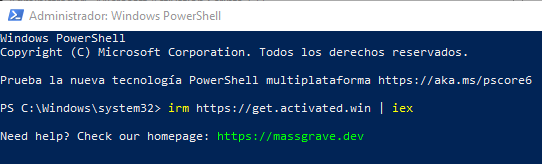
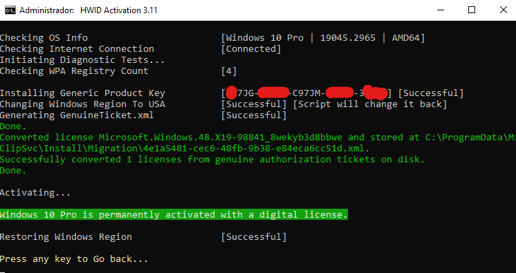
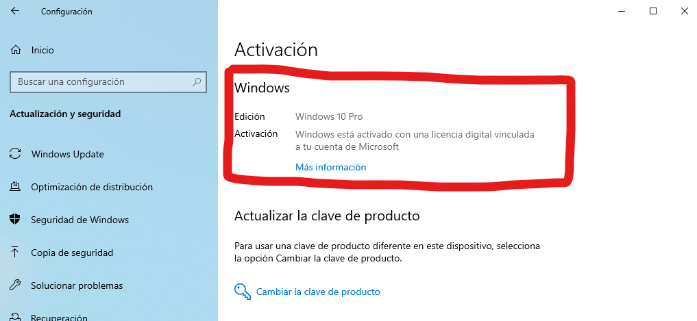
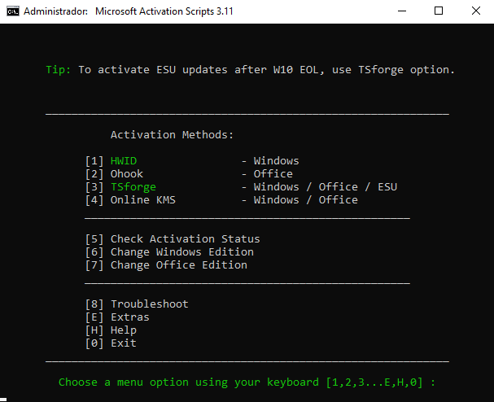
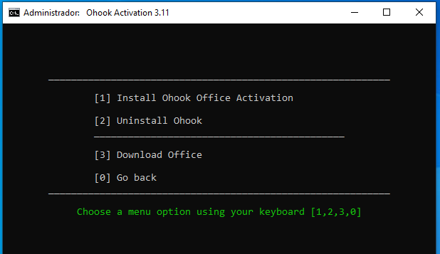
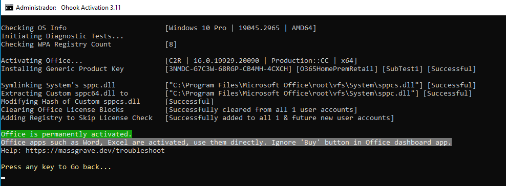

# 🪟 Windows & Office Activation Guide (MAS · HWID · Ohook)

## 📑 Índice

1. [Introducción](#-1-introducción)
2. [Requisitos previos](#-2-requisitos-previos)
3. [Ejecución del script MAS](#-3-ejecución-del-script-mas)
4. [Activación de Windows con HWID](#-4-activación-de-windows-con-hwid)
5. [Verificación de la activación de Windows](#-5-verificación-de-la-activación-de-windows)
6. [Activación de Office con Ohook](#-6-activación-de-office-con-ohook)
7. [Verificación de la activación de Office](#-7-verificación-de-la-activación-de-office)
8. [Notas importantes](#-8-notas-importantes)
9. [Aviso legal / responsabilidad](#-9-aviso-legal--responsabilidad)

---

## 📌 1. Introducción

En este proyecto se documenta el proceso de activación de **Windows 10 Pro** y **Microsoft 365** utilizando **Microsoft Activation Scripts (MAS)**, una herramienta de código abierto disponible en [massgrave.dev](https://massgrave.dev).

El proceso se divide en dos bloques principales:

- 🪟 **Activación de Windows** mediante el método **HWID**, que genera una licencia digital permanente vinculada al hardware del equipo.
- 📦 **Activación de Office** mediante el método **Ohook**, que parchea la verificación de licencia directamente en las DLLs del sistema.

Ambos métodos son los más estables y recomendados por la comunidad, y no requieren servidores KMS externos ni reactivaciones periódicas.

---

## ⚙️ 2. Requisitos previos

Antes de ejecutar el script, asegúrate de cumplir los siguientes puntos:

- Sistema operativo **Windows 10/11** instalado
- **Microsoft Office** instalado previamente (necesario para el método Ohook)
- Conexión a internet activa
- PowerShell abierto como **Administrador**
- Antivirus temporalmente desactivado o con excepción añadida (algunos AV detectan el script como falso positivo)

---

## 🚀 3. Ejecución del script MAS

El método más directo para lanzar MAS es mediante un único comando en PowerShell como Administrador:

```powershell
irm https://get.activated.win | iex
```

Este comando descarga y ejecuta el script directamente desde los servidores oficiales del proyecto. En la siguiente imagen se puede ver el comando ejecutándose correctamente en una sesión de PowerShell elevada:



Una vez ejecutado, aparecerá el menú principal de **Microsoft Activation Scripts 3.11** con todos los métodos disponibles:


---

## 🪪 4. Activación de Windows con HWID

Para activar Windows, seleccionamos la opción **[1] HWID** desde el menú principal.

Este método genera un **GenuineTicket.xml** vinculado al hardware del equipo, que Microsoft valida de forma permanente como licencia digital. No requiere conexión continua a internet ni renovaciones.

El proceso transcurre de forma completamente automática: el script instala una clave de producto genérica, ajusta temporalmente la región del sistema a Estados Unidos para la validación, genera el ticket y lo convierte en licencia activa.

En la siguiente imagen se puede ver el resultado completo del proceso:



El mensaje **"Windows 10 Pro is permanently activated with a digital license"** confirma que la activación se ha completado con éxito.

---

## ✅ 5. Verificación de la activación de Windows

Una vez finalizado el proceso, podemos comprobar el estado de la activación directamente desde **Configuración → Actualización y seguridad → Activación**.

Como se observa en la imagen, Windows reconoce la licencia como una **licencia digital vinculada a la cuenta de Microsoft**:



Esto significa que la activación sobrevivirá a reinstalaciones del sistema operativo siempre que se utilice la misma cuenta de Microsoft en el mismo hardware.

---

## 📦 6. Activación de Office con Ohook

Para activar Microsoft Office, volvemos al menú principal de MAS y seleccionamos la opción **[2] Ohook**.

Esto nos lleva al submenú de activación de Office, donde elegimos **[1] Install Ohook Office Activation**:



El método Ohook funciona reemplazando la DLL `sppc.dll` del directorio de Office por una versión personalizada que omite la verificación de licencia. Todo el proceso es automático.

En la imagen siguiente se puede ver la ejecución completa, incluyendo la instalación de la clave genérica, el symlinking de la DLL y la limpieza de los bloques de licencia existentes:



El mensaje **"Office is permanently activated"** confirma que la activación se ha aplicado correctamente.

---

## ✅ 7. Verificación de la activación de Office

Para confirmar el resultado, abrimos cualquier aplicación de Office. En la sección **Archivo → Cuenta** podemos ver el estado de la suscripción.

Como se muestra en la imagen, la aplicación reconoce el producto como **Microsoft 365** con suscripción activa, sin ningún aviso de activación pendiente:



Las aplicaciones del paquete como Word, Excel, PowerPoint y Outlook funcionan con total normalidad sin mostrar ningún mensaje de compra o renovación.

---

## 🧠 8. Notas importantes

- El método HWID **no funciona** si Windows no está conectado a internet durante el proceso
- Ohook **requiere** que Office esté instalado antes de ejecutar el script
- Algunos antivirus como Defender pueden bloquear la descarga; añadir una excepción temporal resuelve el problema
- El método Ohook **no es compatible** con versiones de Office instaladas desde la Microsoft Store
- Se recomienda usar siempre la versión más reciente de MAS disponible en [massgrave.dev](https://massgrave.dev)
- No es necesario desactivar ni volver a ejecutar el script tras actualizaciones del sistema

---

## ⚖️ 9. Aviso legal / responsabilidad

Este proyecto ha sido documentado con fines **exclusivamente educativos y técnicos**.

El autor no asume ninguna responsabilidad por el uso que se haga de esta información fuera de un entorno de laboratorio o pruebas controladas.

El uso de herramientas de activación puede infringir los **Términos de Servicio de Microsoft**. Se recomienda el uso de licencias oficiales en entornos de producción o uso profesional.

---

## 📦 Resultado final

Mediante este proceso se ha demostrado el flujo completo de activación utilizando MAS:

- Ejecución del script mediante PowerShell como Administrador
- Activación permanente de Windows 10 Pro con licencia digital vía HWID
- Activación permanente de Microsoft 365 mediante el método Ohook
- Verificación del estado en ambos casos desde la propia interfaz del sistema

Todo ello sin necesidad de claves de producto, servidores KMS externos ni suscripciones de pago.
